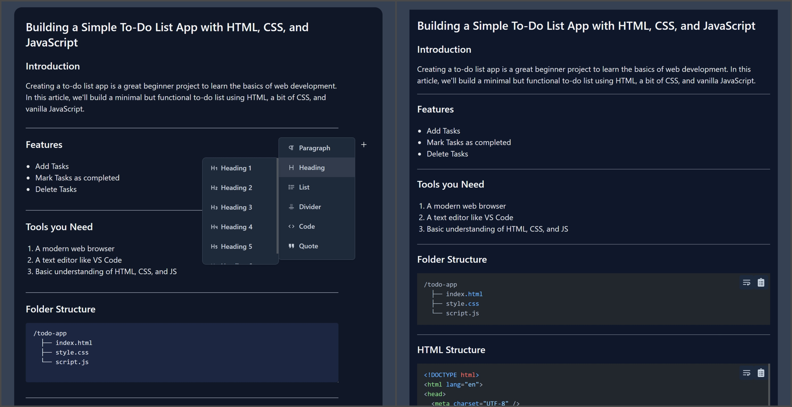

# ✍️ ArticWriter

**ArticWriter** is a ⚡ powerful block-based article editor with an integrated HTML renderer. Write your content with flexible blocks, customize your tools, and render clean HTML — all from a single package.

---

## 🌐 Demo
Checkout [Demo of articwriter](https://modasser.is-a.dev/articwriter/)

---

## 🚀 Features

-   🧱 **Block-based article writing**
-   ✨ **Inline tools** support
-   🧩 **Custom editor block plugins**
-   🔧 **Inline tool plugins**
-   🎨 **Renderer block plugins**
-   🎨 **Per-block Style Customization (renderer)**
-   🌙 **Dark Mode** supported
-   ⚛️ **Optimized for React projects**

---

## 🖼️ Preview

Editor and Renderer side by side:


## 📦 Installation

Using **npm**:

```bash
# using npm
npm install articwriter

# using yarn
yarn add articwriter
```

---

## 📁 Package Structure

```bash
articwriter/
├── editor     # The full-featured editor
└── renderer   # HTML renderer for the written content
```

-   `editor` → Used to create and manage blocks
-   `renderer` → Used to render the saved content

> 📌 The root package does not export anything directly.

---

## 🔧 Examples

### Editor

```jsx
import Editor from "articwriter/editor";

const [Component, save] = Editor({
    config: {
        uploadImage: async (file) => {
            return `file_url.png`;
        },
    },
});

return (
    <>
        <Component />
        <button
            onClick={async () => {
                const data = await save();
                console.log(data);
            }}
        >
            Save
        </button>
    </>
);
```

### Renderer

```jsx
import Renderer from "articwriter/renderer";

const [Component] = Renderer({
    // config
});

return <Component blocks={blocks} />;
```

---

## ⚙️ Configurations

### Editor

| Prop         | Type         | Description                                  |
| ------------ | ------------ | -------------------------------------------- |
| blocks       | `List`       | Initial blocks data to load in the editor    |
| defaultBlock | `string`     | Default block type (e.g. `"paragraph"`)      |
| plugins      | `List`       | Editor plugin which follows the Plugin Rules |
| config       | `UserConfig` | Config options (see below)                   |

#### `UserConfig`:

| Key         | Type                              | Description                                          |
| ----------- | --------------------------------- | ---------------------------------------------------- |
| uploadImage | `(file: File) => Promise<string>` | Async function to upload images, returning image URL |

### Renderer

| Prop    | Type         | Description                                    |
| ------- | ------------ | ---------------------------------------------- |
| plugins | `List`       | Renderer plugin which follows the Plugin Rules |
| config  | `UserConfig` | Config options (see below)                     |

#### `UserConfig`:

| Key       | Type                                                  | Description                                                        |
| --------- | ----------------------------------------------------- | ------------------------------------------------------------------ |
| blockName | `{ className?: string; style?: React.CSSProperties }` | Styles for each block type. Use lowercase names (e.g. `paragraph`) |

---

## 🔧 Built-in blocks

| Block Name  | Usage Name (lowercase) |
| ----------- | ---------------------- |
| Paragraph   | `paragraph`            |
| Heading     | `heading`              |
| List        | `list`                 |
| Divider     | `divider`              |
| Code        | `code`                 |
| Quote       | `quote`                |
| Image       | `image`                |
| HTMLPreview | `html-preview`         |
| Table       | `table`                |

## 🛠️ Tech Stack

-   🧑‍💻 Built with **React** + **Tailwind CSS**
-   🔁 Compatible with all React versions (React 18+ recommended)
-   📦 No external framework dependencies

---

## 📜 License

MIT License @TheProjectsX
